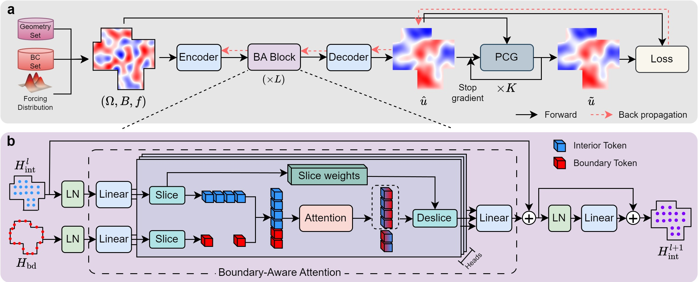

# NPSolver: Neural Poisson Solver with Iterative Physics Supervision

**Official Pytorch Implementation** | KDD 2026

**Authors:** Bocheng Zeng*, Zhang Rui*, Runze Mao, Mengtao Yan, Xuan Bai, Yang Liu, Zhi X. Chen, Hao Sun.


[](https://arxiv.org/abs/2605.25786)

>**Abstract**: Efficiently solving Poisson equations on complex, irregular domains remains a fundamental challenge in scientific computing, as classical iterative solvers often suffer from prohibitive runtime due to ill-conditioned systems. While neural operators offer a fast alternative, they typically rely on large-scale labeled datasets or struggle with unstable training dynamics when using physics-informed residual losses. We propose \textsc{NPSolver}, a neural Poisson solver trained without solution labels via iterative physics supervision. Instead of relying on fully converged numerical solutions or raw PDE residuals, \textsc{NPSolver} utilizes a small number of preconditioned conjugate gradient (PCG) steps to refine its own predictions, providing a more stable and well-scaled training signal. Theoretical analysis confirms that this iterative supervision serves as a well-conditioned error proxy and that a stop-gradient design is essential for optimization stability. To better capture boundary-driven features under mixed boundary conditions, we further introduce the Boundary-Aware Transolver (\textsc{BA-Transolver}) architecture that explicitly separates interior and boundary tokenization. Extensive evaluations on 2D and 3D irregular geometries demonstrate that \textsc{NPSolver} outperforms both physics-informed and data-driven baselines. Furthermore, a downstream thermal control task highlights the model's capability for conducting efficient and reliable gradient-based boundary control. We will release our codes and data at https://github.com/intell-sci-comput/NPSolver.

## ✨Highlights


- NPSolver, a label-free neural Poisson solver built on BA-Transolver model and trained with an iterative physics supervision objective.
- BA-Transolver model, which separately tokenizes interior and boundary nodes.
- Theoretical guarantees for iterative physics supervision.

## Implemented Features

- 2D on corner-removed square: Dirichlet / Neumann / RandomBC
- 3D on cube-with-cylindrical-hole: coming soon
- Control task: coming soon

## Installation

**1. Clone the repository**

```shell
git clone https://github.com/intell-sci-comput/NPSolver.git
cd NPSolver
```

**2. Create an environment and install dependencies**
```shell
conda create -n npsolver python=3.12
conda activate npsolver
pip install -r requirements.txt
```

## Data Preparation

The datasets and pretrained checkpoints used in our experiments are publicly available on Hugging Face:

- Datasets: https://huggingface.co/datasets/bochengz/NPSolver_datasets/tree/main
- Checkpoints: https://huggingface.co/bochengz/NPSolver_models/tree/main

Please download the required files and store them in your local workspace. 

## Project Structure and Configuration

The current release mainly includes the 2D implementation of NPSolver. The repository is organized as follows:

```text
NPSolver/
├── npsolver_2d/
│   ├── exp_2d.py
│   ├── configs/
│   │   ├── config.yaml
│   │   └── exp/
│   │       ├── dirichlet.yaml
│   │       ├── neumann.yaml
│   │       └── random_bc.yaml
│   └── src/
│       ├── datasets/
│       ├── fvm_residulers/
│       ├── fvm_solvers/
│       ├── models/
│       └── trainers/
├── assets/
├── requirements.txt
└── README.md
```

The main entry point is `npsolver_2d/exp_2d.py`. The project uses Hydra for configuration management:

- `npsolver_2d/configs/config.yaml` defines the global runtime settings, such as `project.mode`, `project.device`, and `output.path`.
- `npsolver_2d/configs/exp/*.yaml` defines experiment-specific settings, including dataset paths, boundary-condition types, model hyperparameters, and training parameters, which are the default settings used to reproduce the experiments reported in the paper.
- The active experiment config is selected through the `defaults` field in `config.yaml`.

Before running the code, please update the directory-related fields in the config files to match your local environment, especially:

- `data.mesh_dir`
- `data.sol_dir`
- `output.path`

We recommend storing downloaded files in a local layout such as:

```text
data/
├── mesh/
│   └── ...
├── poisson/
│   └── ...
└── checkpoints/
    └── ...
```

Then set `data.mesh_dir` and `data.sol_dir` to the corresponding local directories, and set `output.path` to the directory where you want checkpoints, logs, and test outputs to be saved.

This project uses SwanLab to upload training logs to the cloud. If you do not want to use SwanLab, you can comment out the related code in:

- `npsolver_2d/exp_2d.py`, such as `swanlab.init(...)`
- `npsolver_2d/src/trainers/npsolver_trainer.py`, such as `swanlab.log(...)`

The project will still save local logs, checkpoints, and test outputs under `output.path` even if SwanLab is disabled.

## Quick start

After configuring the relevant paths in the config files, you can run the 2D experiments from the `npsolver_2d/` directory:

```shell
cd npsolver_2d
```

To launch the Dirichlet experiment:

```shell
python exp_2d.py exp=dirichlet
```

To launch the Neumann experiment:

```shell
python exp_2d.py exp=neumann
```

To launch the RandomBC experiment:

```shell
python exp_2d.py exp=random_bc
```

The training or evaluation behavior is controlled by `project.mode` in `configs/config.yaml`:

- `project.mode=train` for training
- `project.mode=test` for evaluation

You can also override config values from the command line when needed. For example:

```shell
python exp_2d.py exp=dirichlet project.mode=train
python exp_2d.py exp=neumann project.mode=test
```

During training, `output.name` is typically generated automatically from the current run time and is used to create a unique output directory for logs and checkpoints. During evaluation with `project.mode=test`, please make sure `output.name` is set to the name of the checkpoint you want to load.

To evaluate with our pretrained checkpoints, please first set `output.path` to the directory where the downloaded checkpoints are stored. Then, for the Dirichlet setting, you can use either of the following two ways:

1. Set `output.name=ba-transolver_dirichlet` in the config file, then run:

```shell
python exp_2d.py exp=dirichlet project.mode=test
```

2. Override `output.name` directly from the command line:

```shell
python exp_2d.py exp=dirichlet project.mode=test output.name=ba-transolver_dirichlet
```

## Citation

```bibtex
@inproceedings{
    zeng2026npsolver,
    title={{NPS}olver: Neural Poisson Solver with Iterative Physics Supervision},
    author={Bocheng Zeng and Rui Zhang and Runze Mao and Mengtao Yan and Xuan Bai and Yang Liu and Zhi X. Chen and Hao Sun},
    booktitle={32nd SIGKDD Conference on Knowledge Discovery and Data Mining - AI for Sciences Track},
    year={2026}
}
```

## 🤝 Acknowledgement

This work is supported by the Beijing Natural Science Foundation, the National Natural Science Foundation of China, the China Postdoctoral Science Foundation,  and the Postdoctoral Fellowship
Program of CPSF. We thank collaborators from **Renmin University of China**, **Peking University**, **AI for Science Institute**, and **Huawei Technologies Ltd.**
